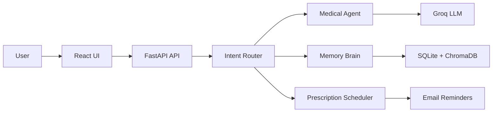

# NeuralFlow Medical Assistant

NeuralFlow is an AI-powered medical triage and health-management assistant. It combines intent routing, ReAct-style medical reasoning, long-term memory, prescription tracking, and reminder scheduling in one FastAPI + React workspace.

> Not a medical device. This project is intended for informational and triage support only.

## Architecture

- FastAPI exposes chat, auth, vitals, prescriptions, sessions, and reminder endpoints.
- The router classifies each message into medical, memory, search, teaching, prescription, or chat flows.
- The medical agent handles symptom analysis and follow-up questions.
- The memory brain stores user facts in ChromaDB and retrieves them when context matters.
- The prescription agent and APScheduler-based reminder service manage medication schedules and email reminders.
- The React/Vite frontend handles chat, history, vitals, prescriptions, and OAuth login.



## Problem + Solution

**Problem:** medical conversations are fragmented, context is easy to lose, and reminder workflows usually live in separate tools.

**Solution:** route every message to the right workflow, persist memory and vitals, and keep prescriptions and reminders in the same assistant so the user gets a single source of truth.

## Tech Stack

- Python 3.11
- FastAPI
- LangChain
- Groq
- ChromaDB
- SQLite
- APScheduler
- Authlib
- bcrypt
- React
- Vite
- Tailwind CSS
- Framer Motion
- Lucide React

## Key Features

- Symptom triage with clarifying follow-up questions
- Persistent memory for allergies, conditions, and personal facts
- Medication tracking and reminder scheduling
- Vitals logging for health trends
- Google OAuth login
- Search and general knowledge routing

## Run Locally

Backend:

```bash
python -m venv venv
source venv/bin/activate
pip install -r requirements.txt
python -m src.api
```

Frontend:

```bash
cd frontend
npm install
npm run dev
```

## Safety Note

NeuralFlow is not a substitute for a doctor or licensed medical professional. If symptoms are severe or urgent, seek medical care immediately.
